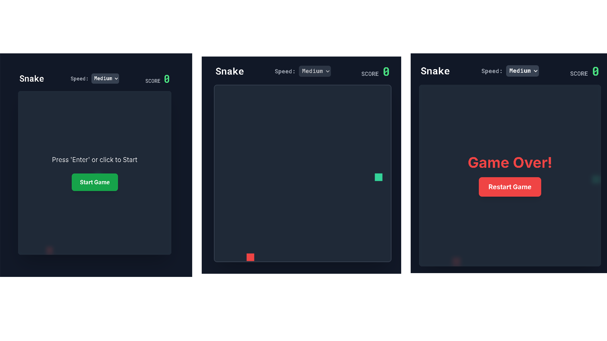
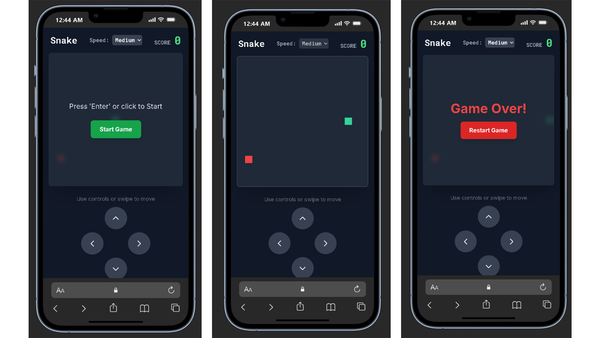

# simple-snake-game

  

A tiny, browser-based **Snake** game implemented with plain **HTML**, **CSS**, and **JavaScript**.

> Open `index.html` in any modern browser and use the arrow keys to play.

---

## 🚀 Demo

No build or server required — just open `index.html` in your browser. You can add a GIF or screenshot to this section to show gameplay:

```markdown

```



---

## ✨ Features

* Classic snake movement and growth when eating food.
* Collision detection with walls and self.
* Score tracking.
* Minimal, dependency-free code — great for learning and customizing.

---

## 🧭 Controls

* **Arrow keys** — Move the snake (Up / Down / Left / Right)
* **Refresh page** — Restart game after losing

---

## 🗂️ Project Structure

```
simple-snake-game/
├── index.html       # main game page
├── style.css        # styling for board, snake, and food
├── script.js        # game logic (movement, collisions, scoring)
└── assets/          # (optional) images, gifs, screenshots
```

---

## ⚙️ Run locally

1. Clone the repository:

```bash
git clone https://github.com/Kyra-Code79/simple-snake-game.git
cd simple-snake-game
```

2. Open `index.html` in your preferred browser (double-click or `File → Open`).

3. Play using the arrow keys.

---

## 🛠️ How it works (brief)

* `script.js` maintains the snake as an array of grid positions and updates its position on a game tick.
* On eating food the snake array grows and score increments.
* Collision with the wall or the snake's own body ends the game.

(If you'd like, I can add a short commented walkthrough of `script.js` here.)

---

## 💡 Ideas for improvement

* Add mobile/touch support (swipe controls).
* Add persistent high-score using `localStorage`.
* Add different levels (obstacles, increasing speed).
* Add sound effects and a pause button.
* Keyboard accessibility tweaks.

---

## 🤝 Contributing

Contributions are welcome! To contribute:

1. Fork the repository
2. Create a feature branch: `git checkout -b feat/my-feature`
3. Commit your changes: `git commit -m "feat: add …"`
4. Push and open a pull request

Please keep changes focused and include screenshots/GIFs for UI changes.

---

## 📝 License

This project is open-source under the **MIT License**.

---

## 📫 Author

Created by **Kyra-Code79** — feel free to open issues or pull requests on GitHub.
LINKEDIN - **in/habibisiregar79**
---
